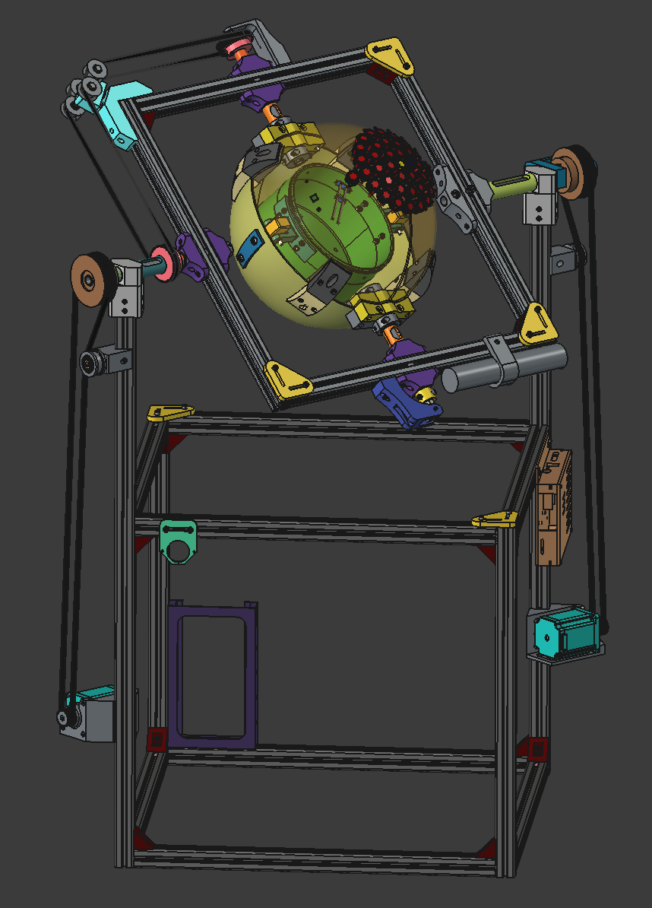

# Clinostat-cad

</img>

2 axis clinostat for microgravity plant cultivation. Made with FreeCAD. Some models are imported from Autodesk Inventor, so they are avaiable only in step format.

Main assembly in clinostate/Clinostate.FCStd

You will need Fasteners workbench for screws. Render and Exploded Assembly workbench are optional.

In content/CultivationController/Sensors_hat you can find electronic design for hat that exposes connections to sensors.

This is part of my PhD Thesis: The use of a long-term space flight simulator based on embedded systems to analyze the life cycle of selected elements of animated nature,

supervised by Prof. Tomasz Błachowicz: https://www.researchgate.net/profile/Tomasz-Blachowicz

<3

## License 
CERN-OHL-P V2.0,

except elements in:
 - content/IGUS - from igus® CAD Library, license unspecified
 - content/ITEM - ITEM step files from ITEM cad library, license unspecified
 - content/NEMA - https://grabcad.com/library/nema-24, license: https://grabcad.com/terms, login needed to download
 - content/Pneumatic - license unspecified, from:
 - - K_1-8: https://www.pneumat.com.pl/125018-4-zlaczka-pneumatyczna-wtykowa-katowa-do-weza-fi-4-mm-g-1-8-gz-tworzywo-sztuczne
 - - P_1-8: https://www.pneumat.com.pl/124018-4-zlaczka-pneumatyczna-wtykowa-prosta-do-weza-fi-4-mm-g-1-8-gw-mosiadz-niklowany
 - content/parametric_pulley_generator - CC BY-NC-SA 4.0, https://www.printables.com/model/832111-parametric-pulley-for-toothed-belts-in-openscad-re
 - content/SKF - from SKF cad library, license unspecified
 - content/CultivationController/UsbHat - https://grabcad.com/library/raspberry-pi-4-port-usb-hub-hat-1, license: https://grabcad.com/terms, login needed to download
 - content/CultivationController/OPI_zero_2W - https://grabcad.com/library/orangepi-zero-2w-1, license: https://grabcad.com/terms, login needed to download
